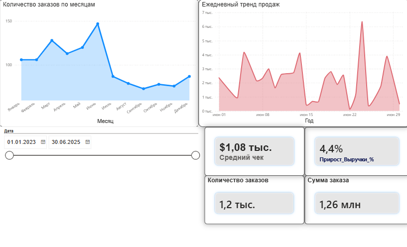
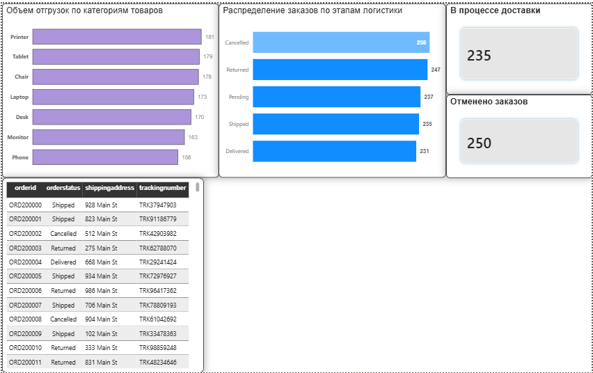

# Анализ продаж и операционный контроль логистики (Python + Power BI)

## Описание проекта
Бизнес-решение для сквозного анализа коммерческих показателей и мониторинга логистических процессов компании. Проект автоматизирует цепочку от сырых выгрузок до интерактивной управленческой отчетности.

## Использованный стек
* **Python (Pandas, NumPy):** Очистка данных, обработка пропусков, приведение типов, первичный ETL-процесс.
* **Power BI:** Проектирование модели данных, написание мер на DAX, создание интерактивного UI/UX дашборда.

## Этапы реализации

### 1. Предобработка данных (Python)
* Реализован скрипт для очистки сырых данных из таблиц продаж (`clean_sales`) и логистики (`clean_logistics`).
* Обработаны аномалии, удалены дубликаты, стандартизированы форматы дат и текстовых полей.
* Данные подготовлены и экспортированы для бесшовной интеграции с BI-системой.

### 2. Моделирование и DAX (Power BI)
* Связаны таблицы продаж и логистики.
* Написаны бизнес-метрики на DAX: расчет динамики выручки (`Прирост_Выручки_%`), среднего чека, объемов отгрузок в штуках и финансового оборота.

### 3. Визуализация и UI/UX
Дашборд разделен на два смысловых уровня под разные роли в компании:
* **Страница 1 «Обзор продаж» (Стратегическая):** Контроль выручки, среднего чека, динамики заказов по месяцам и ежедневных трендов для руководства.
* **Страница 2 «Операционный контроль» (Тактическая):** Анализ физического объема отгрузок по категориям, распределение заказов по этапам логистики, KPI-карточки проблемных зон (в пути/отменено) и таблица детализации для менеджеров.

## Скриншоты дашборда

### Страница 1: Обзор продаж

### Страница 2: Операционный контроль логистики

## Как запустить проект
1. Скрипт очистки находится в папке `scripts/data_cleaning.py`.
2. Файл дашборда доступен в `reports/dashboard.pbix` (требуется Power BI Desktop).
